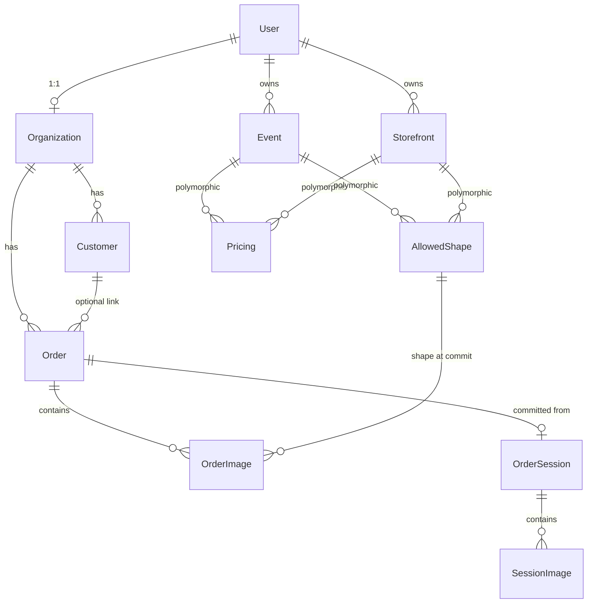

# Database Model

Photo Magnet SaaS — PostgreSQL schema as implemented in `prisma/schema.prisma`.

**Last synced:** July 2026

---

## Overview

Photo Magnet SaaS is a multi-tenant seller platform. Sellers (`User` + `Organization`) run **Events** or **Storefronts**. Customers checkout via **OrderSession** → committed **Order** with immutable **OrderImage** snapshots.

**Key design principles:**

- Soft delete on most business tables (`deletedAt`)
- Polymorphic context: `contextType` + `contextId` → Event or Storefront
- Checkout is session-based; orders are immutable snapshots at commit
- Print-critical crop data lives on `SessionImage` (live) and `OrderImage` (committed)

---

## Entity Relationship Diagram



---

## Enums

| Enum | Values |
|------|--------|
| `Role` | `ADMIN`, `STAFF` |
| `Plan` | `FREE`, `HOBBY`, `PRO` |
| `ContextType` | `EVENT`, `STOREFRONT` |
| `PricingType` | `PER_ITEM`, `BUNDLE` |
| `ShapeType` | `SQUARE`, `CIRCLE`, `RECTANGLE` |
| `OrderStatus` | `NEW`, `CONFIRMED`, `INVOICE_SENT`, `PAID`, `IN_PRODUCTION`, `SHIPPED`, `COMPLETED`, `CANCELLED` |
| `OrderSessionStatus` | `ACTIVE`, `ABANDONED`, `CONVERTED`, `EXPIRED` |
| `SessionCheckoutStage` | `BUILDING`, `CUSTOMER_DETAILS`, `COMPLETED`, `ABANDONED` |
| `SessionImageStatus` | `UPLOADED`, `FAILED` |

---

## 1. Identity & Tenancy

### `User`

Seller account (auth via Clerk).

| Column | Type | Notes |
|--------|------|-------|
| `id` | UUID | PK |
| `clerkId` | String? | Unique; Clerk external user id |
| `email` | String | Unique |
| `name` | String? | |
| `passwordHash` | String? | Legacy only |
| `role` | `Role` | Default `ADMIN` |
| `createdAt` | DateTime | |
| `updatedAt` | DateTime | |
| `deletedAt` | DateTime? | Soft delete |

**Relations:** 1:1 `Organization`, 1:N `Event`, 1:N `Storefront`

---

### `Organization`

Seller tenant. **1:1 with User** (`Organization.id` = `User.id`).

| Column | Type | Notes |
|--------|------|-------|
| `id` | UUID | PK, FK → `User.id` (cascade delete) |
| `plan` | `Plan` | Default `FREE` |
| `ordersThisMonth` | Int | Default 0 |
| `orderLimit` | Int | Default 10 (FREE cap) |
| `eventsCreatedThisMonth` | Int | Default 0 |
| `eventLimit` | Int | Default 1 |
| `currentPeriodStart` | DateTime | Order/event quota period |
| `currentPeriodEnd` | DateTime | |
| `subscriptionPeriodStart` | DateTime? | Clerk subscription renewal |
| `subscriptionPeriodEnd` | DateTime? | |
| `stripeCustomerId` | String? | Unique |
| `stripeSubscriptionId` | String? | |
| `clerkSubscriptionId` | String? | Clerk Billing subscription |
| `clerkPlanSlug` | String? | e.g. `free_user`, `hobby`, `pro` |
| `currency` | String? | ISO 4217; magnet pricing only |
| `initialSetupAt` | DateTime? | Set when currency first saved |
| `dateFormat` | String? | `DMY` \| `MDY` \| `YMD` (UI only) |
| `sizeUnit` | String? | `mm` \| `cm` \| `in` (UI only) |
| `name` | String? | Business/shop display name |
| `resendApiKeyEncrypted` | String? | AES-256-GCM (Pro email) |
| `resendFromEmail` | String? | Verified sender (Pro) |
| `resendFromName` | String? | |
| `resendConfiguredAt` | DateTime? | |

**Relations:** 1:N `Order`, 1:N `Customer`

---

## 2. Sales Channels

### `Event`

In-person / event-based selling.

| Column | Type | Notes |
|--------|------|-------|
| `id` | UUID | PK |
| `userId` | UUID | FK → `User` |
| `name` | VarChar(100) | |
| `startDate` | DateTime | |
| `endDate` | DateTime | |
| `isActive` | Boolean | Default true |
| `maxMagnetsPerOrder` | Int? | Business cap |
| `brandText` | VarChar(40)? | On print PDFs |
| `bannerUrl` | String? | Public entry page banner |
| `notificationEmail` | String? | |
| `sendOrderEmails` | Boolean | Default false |
| `createdAt` | DateTime | |
| `updatedAt` | DateTime | |
| `deletedAt` | DateTime? | Soft delete |

**Index:** `userId`

---

### `Storefront`

Online shop with pickup/shipping.

| Column | Type | Notes |
|--------|------|-------|
| `id` | UUID | PK |
| `userId` | UUID | FK → `User` |
| `name` | String | |
| `isActive` | Boolean | Default true |
| `maxMagnetsPerOrder` | Int? | |
| `brandText` | VarChar(40)? | |
| `notificationEmail` | String? | |
| `sendOrderEmails` | Boolean | Default false |
| `pickupAddress` | Json? | `{ street, house_number, city, post_code, country }` |
| `vacationFrom` | DateTime? | Inclusive UTC date (Hobby+) |
| `vacationTo` | DateTime? | Inclusive UTC date |
| `vacationNote` | VarChar(500)? | Shown during vacation |
| `createdAt` | DateTime | |
| `updatedAt` | DateTime | |
| `deletedAt` | DateTime? | Soft delete |

**Index:** `userId`

---

## 3. Pricing & Shapes

### `Pricing`

Polymorphic: belongs to Event or Storefront via `contextType` + `contextId`.

| Column | Type | Notes |
|--------|------|-------|
| `id` | UUID | PK |
| `contextType` | `ContextType` | `EVENT` or `STOREFRONT` |
| `contextId` | String | No FK (polymorphic) |
| `type` | `PricingType` | `PER_ITEM` or `BUNDLE` |
| `price` | Decimal(10,2) | |
| `currency` | String | Default `EUR`; copied from org at write |
| `quantity` | Int? | Bundle tier size |
| `displayOrder` | Int? | |
| `createdAt` | DateTime | |
| `updatedAt` | DateTime | |
| `deletedAt` | DateTime? | Soft delete |

**Index:** `(contextType, contextId)`

**Constraint (business rule):** Per context, only `PER_ITEM` **or** `BUNDLE` — never both. `PER_ITEM` = one row; `BUNDLE` = one or more rows.

---

### `AllowedShape`

Magnet shapes available per Event/Storefront.

| Column | Type | Notes |
|--------|------|-------|
| `id` | UUID | PK |
| `contextType` | `ContextType` | |
| `contextId` | String | Polymorphic |
| `shapeType` | `ShapeType` | `SQUARE`, `CIRCLE`, `RECTANGLE` |
| `widthMm` | Float | Stored in mm |
| `heightMm` | Float | Stored in mm |
| `displayOrder` | Int | Default 0 |

**Unique:** `(contextType, contextId, shapeType, widthMm, heightMm)`  
**Index:** `(contextType, contextId)`

---

## 4. Customer CRM (Pro)

### `Customer`

Seller CRM record; created/updated at order commit.

| Column | Type | Notes |
|--------|------|-------|
| `id` | UUID | PK |
| `organizationId` | UUID | FK → `Organization` |
| `name` | String | |
| `email` | String? | |
| `phone` | String? | |
| `createdAt` | DateTime | Earliest linked order |
| `updatedAt` | DateTime | |
| `deletedAt` | DateTime? | Soft delete; orders keep snapshots |

**Matching rule (per org):** email (case-insensitive) first, then normalized phone.

**Indexes:** `organizationId`, `(organizationId, deletedAt)`, `(organizationId, email)`, `(organizationId, phone)`

---

## 5. Checkout Session (pre-order)

### `OrderSession`

Temporary checkout state before order commit.

| Column | Type | Notes |
|--------|------|-------|
| `id` | UUID | PK |
| `contextType` | `ContextType` | |
| `contextId` | String | |
| `status` | `OrderSessionStatus` | Default `ACTIVE` |
| `checkoutStage` | `SessionCheckoutStage` | Default `BUILDING` |
| `createdAt` | DateTime | |
| `expiresAt` | DateTime | |
| `lastActiveAt` | DateTime | Bumped on activity |
| `startedAt` | DateTime | |
| `checkoutImageCopies` | Json? | `[{ imageId, copies }]` snapshot at Stripe redirect |
| `bundleId` | String? | Pricing row id when bundle |
| `pricingType` | `PricingType?` | |
| `quantity` | Int? | |
| `selectedShapeId` | String? | |
| `totalPrice` | Decimal(10,2)? | |
| `orderId` | String? | Unique; set on commit |
| `stripeCheckoutSessionId` | String? | |
| `stripePaymentIntentId` | String? | |
| `stripePaymentStatus` | String? | |
| `checkoutCustomerName` | String? | |
| `checkoutCustomerEmail` | String? | |
| `checkoutCustomerPhone` | String? | |
| `checkoutShippingType` | String? | |
| `checkoutShippingAddress` | Json? | |

**Relations:** 1:1 optional `Order`, 1:N `SessionImage`

**Indexes:** `(contextType, contextId)`, `expiresAt`, `lastActiveAt`, `checkoutStage`

---

### `SessionImage`

Live images during checkout (crop editor state).

| Column | Type | Notes |
|--------|------|-------|
| `id` | UUID | PK |
| `sessionId` | UUID | FK → `OrderSession` |
| `originalUrl` | String | |
| `width` | Int | Original dimensions |
| `height` | Int | |
| `fileSize` | Int | |
| `status` | `SessionImageStatus` | Default `UPLOADED` |
| `position` | Int | Order in session |
| `isLowResolution` | Boolean | Default false |
| `cropX` | Int? | **Pixels** in original image |
| `cropY` | Int? | |
| `cropWidth` | Int? | |
| `cropHeight` | Int? | |
| `cropRotation` | Float | Default 0 |
| `cropScale` | Float? | Zoom factor |
| `cropTranslateX` | Float? | Pan in frame px |
| `cropTranslateY` | Float? | |
| `mediaDeletedAt` | DateTime? | Blob removed; row retained |
| `createdAt` | DateTime | |

**Indexes:** `sessionId`, `(sessionId, position)`, `(sessionId, mediaDeletedAt)`

---

## 6. Orders (committed)

### `Order`

Immutable order container after checkout commit.

| Column | Type | Notes |
|--------|------|-------|
| `id` | UUID | PK |
| `organizationId` | UUID | FK → `Organization` |
| `contextType` | `ContextType` | |
| `contextId` | String | Polymorphic (no FK) |
| `status` | `OrderStatus` | Default `NEW` |
| `totalPrice` | Decimal(10,2) | |
| `currency` | String | Default `EUR`; snapshot at commit |
| `pricingType` | `PricingType` | Snapshot from session |
| `quantity` | Int? | |
| `bundleId` | String? | |
| `customerId` | String? | FK → `Customer` (`ON DELETE SET NULL`) |
| `customerName` | String? | **Immutable snapshot** |
| `customerEmail` | String? | **Immutable snapshot** |
| `customerPhone` | String? | **Immutable snapshot** |
| `shippingType` | String? | Storefront |
| `shippingAddress` | Json? | Storefront |
| `eventPaymentPreference` | String? | Event: cash/card on location |
| `stripeCheckoutSessionId` | String? | |
| `stripePaymentIntentId` | String? | |
| `stripeChargeId` | String? | |
| `buyerConfirmationEmailSentAt` | DateTime? | Idempotency guard |
| `printedAt` | DateTime? | Seller marks production done |
| `shippedAt` | DateTime? | |
| `cancellationNote` | String? | |
| `shortCode` | String? | Unique; future 6-char display id |
| `createdAt` | DateTime | |

**Relations:** 1:N `OrderImage`, 1:1 optional `OrderSession`, optional `Customer`

**Indexes:** `organizationId`, `(contextType, contextId)`, `status`, `customerId`

---

### `OrderImage`

**Immutable print snapshot** copied from `SessionImage` at commit. This is the production unit.

| Column | Type | Notes |
|--------|------|-------|
| `id` | UUID | PK |
| `orderId` | UUID | FK → `Order` |
| `originalUrl` | String | |
| `croppedUrl` | String? | |
| `cropX` | Int | **Pixels** (not normalized) |
| `cropY` | Int | |
| `cropWidth` | Int | |
| `cropHeight` | Int | |
| `rotation` | Float | Default 0 |
| `width` | Int | Original image width |
| `height` | Int | Original image height |
| `position` | Int | Print sequence |
| `copies` | Int | Default 1; physical magnet count |
| `shapeId` | UUID | FK → `AllowedShape` |
| `renderedUrl` | String? | Sharp extract output |
| `printed` | Boolean | Default false |
| `printedAt` | DateTime? | |
| `mediaDeletedAt` | DateTime? | Blob removed; row retained |
| `createdAt` | DateTime | |

**Indexes:** `orderId`, `(orderId, position)`, `(orderId, mediaDeletedAt)`, `shapeId`

---

## 7. Webhook Idempotency

### `ProcessedStripeEvent`

| Column | Type | Notes |
|--------|------|-------|
| `id` | String | PK = Stripe `evt_...` id |
| `createdAt` | DateTime | |

### `ProcessedClerkEvent`

| Column | Type | Notes |
|--------|------|-------|
| `id` | String | PK = Svix `svix-id` header |
| `createdAt` | DateTime | |

---

## Relationship Summary

```
User (1) ── (1) Organization
User (1) ── (N) Event
User (1) ── (N) Storefront

Organization (1) ── (N) Order
Organization (1) ── (N) Customer

Customer (1) ── (N) Order          [optional, SET NULL on delete]

Event / Storefront ── (N) Pricing       [polymorphic]
Event / Storefront ── (N) AllowedShape  [polymorphic]
Event / Storefront ── (N) Order         [polymorphic via contextType+contextId]
Event / Storefront ── (N) OrderSession  [polymorphic]

OrderSession (1) ── (N) SessionImage
OrderSession (1) ── (0..1) Order        [on commit]

Order (1) ── (N) OrderImage
AllowedShape (1) ── (N) OrderImage
```

---

## Business Rules & Constraints

1. **Polymorphic context** — `contextType` + `contextId` on `Pricing`, `AllowedShape`, `Order`, `OrderSession`; no DB FK on `contextId`.
2. **Pricing exclusivity** — One pricing mode per context: either `PER_ITEM` (single row) or `BUNDLE` (one+ rows), never both.
3. **Order snapshots** — Customer fields on `Order` are immutable at commit; CRM edits do not rewrite orders.
4. **Crop data** — `SessionImage` uses pixel crops (live editor); `OrderImage` copies them at commit for print.
5. **Soft delete** — `User`, `Event`, `Storefront`, `Pricing`, `Customer` use `deletedAt`; filter with `WHERE deletedAt IS NULL`.
6. **Cash payment** — Allowed only when `contextType = EVENT`.
7. **Print tracking** — Per-line `OrderImage.printed` / `printedAt`; order-level `Order.printedAt` / `shippedAt`.

---

## Docs vs Implementation

| `database-schema.md` mentions | Current state |
|-------------------------------|---------------|
| `Image` table with normalized crop (`crop_x` float) | Replaced by `SessionImage` + `OrderImage` (pixel crops) |
| `PrintBatch` / `PrintBatchItem` | Dropped in migration `phase5f_order_commit`; print tracking is on `OrderImage` |
| `Order.order_number` index | Not present; `shortCode` exists but not yet generated |
| `Order.payment_status` index | Not present; payment tracked via Stripe fields on `Order` / `OrderSession` |

> **Source of truth:** `prisma/schema.prisma` and migrations. See also `docs/database-schema.md` for business rules and design intent.

---

## Mental Model

| Concept | Table | Role |
|---------|-------|------|
| Seller | `User` + `Organization` | Auth, billing, limits, currency |
| Sales channel | `Event` / `Storefront` | Where orders originate |
| Checkout | `OrderSession` + `SessionImage` | Live cart, crop editor, payment |
| Order | `Order` | Committed container with buyer snapshot |
| Production unit | `OrderImage` | One crop → N physical magnets (`copies`) |
| Shape config | `AllowedShape` | Magnet dimensions per channel |
| CRM | `Customer` | Pro feature; linked at commit |
