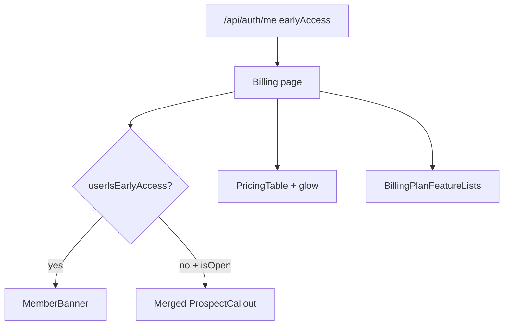

# Billing early-access offer box (merged callout)

**Date:** 2026-07-23  
**Status:** Approved design  
**Goal:** Fix mobile billing layout by removing per-plan Early access banners; keep a single full-width offer box above `<PricingTable />` with banner styling, prominent seat count, and clear Hobby/Pro-only messaging.

## Problem

The billing page stacks three layouts:

1. Per-plan early-access banners (`BillingEarlyAccessPlanBanners`)
2. Clerk `<PricingTable />` cards
3. Custom feature lists (`BillingPlanFeatureLists`)

Desktop CSS aligns columns (Free | Hobby | Pro). On mobile, content stacks as all banners → all cards → all features, so the intended per-plan order (banner → card → features) breaks. CSS/DOM tricks on Clerk’s table cannot reliably fix that.

## Product decisions

| Topic | Decision |
|-------|----------|
| Per-plan banners | Remove entirely |
| Messaging | One merged box above the pricing table (Option A) |
| Visual style | Reuse current blue plan-banner look (gradient, “Launch offer” pill) |
| Seats | Large, highly visible count (“spots left”) |
| Scope of offer | Explicit copy: offer is for Hobby and Pro only |
| Existing callout | Fold into the merged box; do not show two separate prospect boxes |
| Card glow | Keep Hobby/Pro early-access glow on Clerk cards |
| Trial members | Keep `BillingEarlyAccessMemberBanner` unchanged |
| Custom CheckoutButton cards | Out of scope (future if needed) |

## Behavior

When early access is **open** and the user is **not** already an early-access member (`status.isOpen && !status.userIsEarlyAccess`):

1. Render one offer box above `<PricingTable />`.
2. Content hierarchy:
   - Headline (keep “Early access — help us launch” or equivalent)
   - Large seats remaining (tabular number + “spots left”)
   - Clear line: offer applies to **Hobby and Pro only**
   - Body: 60-day free trial · card required (existing prospect body)
   - Expectation copy + feedback links (existing intent)
3. Apply `billing-plans-layout--early-access` so Hobby/Pro cards keep the glow.
4. Feature lists remain below Clerk cards (unchanged column content).

When early access is **closed**, seats are exhausted, or the user is already early access: do not show the prospect offer box (same gates as today’s callout).

Mobile order becomes: offer box (if shown) → plan cards → feature lists. No banner-grid column alignment.

## Components & data flow

**Keep / enhance**

- `BillingEarlyAccessProspectCallout` — restyle into the merged offer box; same visibility gate
- `BillingEarlyAccessMemberBanner` — unchanged
- Card glow CSS under `.billing-plans-layout--early-access`
- Data: `earlyAccess` from `/api/auth/me` cache (`getCachedEarlyAccessStatus`) — no new API

**Change**

- Callout markup + CSS (banner treatment, big seats, Hobby/Pro-only line)
- `earlyAccessCopy.ts` — add Hobby/Pro-only line; remove unused plan-banner subtext if nothing else references it
- `billing/page.tsx` — stop rendering `BillingEarlyAccessPlanBanners`

**Remove**

- `BillingEarlyAccessPlanBanners.tsx`
- CSS for `.billing-early-access-banner-grid`, spacer, and per-plan `.billing-early-access-plan-banner*` (repurpose useful tokens into callout classes)

## Error handling

- No new network calls; if `earlyAccess` is null (auth still loading), show neither prospect box nor member banner (current pattern).
- Seat count comes from cached status; no client-side fallback inventing seat numbers.
- Accessibility: offer box remains a `role="status"` (or equivalent) announcement region; decorative glow stays CSS-only.

## Testing

- Manual: viewport under 640px and at/above 640px with early access open — single box above table; no orphan Hobby/Pro banners; cards + features still readable.
- Manual: early-access member on trial — member banner only, no prospect offer box.
- Manual: early access closed — no offer box; no Hobby/Pro glow class if `isOpen` is false.
- Grep/build: no remaining imports of `BillingEarlyAccessPlanBanners` or dead banner CSS classes.

## Out of scope

- Replacing `<PricingTable />` with custom cards + `CheckoutButton`
- Changing Clerk plan config / trial backend / seat counting
- Loyalty pricing UI
- Marketing landing-page pricing (dashboard billing only)

## Docs to touch on implement

- `docs/CLERK-BILLING.md` — note that per-plan banners were replaced by a single offer box (if that doc mentions plan-card banners)
- `docs/technical-dept.md` — only if a related UI debt item exists; otherwise no change
